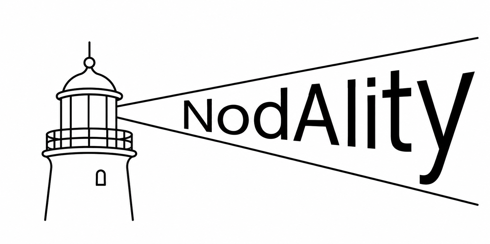

# AIluminode

AIluminode is a wieldable AI pre-reasoning orientation instrument.

It helps AI tools check contextual posture before acting.

It uses NodAIity doctrine, but this repo is standalone.

Core question:

```text
How should I proceed?
```

```text
prompt/task
→ cognitive posture trace
→ route polarity
→ next safe action
```

The core idea is posture before action. AIluminode orients the route; it does not perform retrieval or reasoning.

```text
orientation
→ routing
→ retrieval
→ reasoning
```

## S+R Rule: Orientation Before Action

When starting a new chat, session, or model window, resuming after compaction or a rate-limit interruption, or receiving a new packet, run an orientation scan before reasoning or implementation.

Do not assume prior state.

Use AIluminode to establish posture, active terrain, route polarity, drift risk, and the next safe action. When the full S+R toolkit is available, prefer its full orientation entry point for complete position, continuity, reconnaissance, and posture coverage.

AIluminode does not replace:

- owning authority
- active packet scope
- implementation review
- human governance

If the trace reports drift, or marks a route `PROTECT`, `DEFER`, or `AUDIT`, pause and report that state before acting. Do not convert orientation into authority.

If unexpected pressure, side-corridor evidence, drift, bleed, or a howler appears during execution, scan again before continuing.

Orientation is not optional. It is the gate before reasoning and implementation.

```text
Don't remember. Re-orient.
```

## Orientation Before Retrieval

AIluminode is part of the broader NodAIity orientation research effort.

Current NodAIity doctrine explores the idea that many AI failures may occur before retrieval rather than during reasoning.

Orientation does not replace retrieval or reasoning.

Orientation helps determine:

- where the system is
- which direction it should face
- which terrain is active
- which routes should remain closed

Core doctrine:

```text
Don't reason harder.
Orient first.

Don't run faster.
Follow the compass.
```

## Use

Install locally:

```powershell
python -m pip install -e .
```

Run:

```powershell
ailuminode scan "Refactor Paula EPUB source handling without touching memory save logic"
```

Or without installation:

```powershell
python -m ailuminode scan "Read airframe.epub section 5 without saving it as memory"
```

## Output

```text
AIluminode TRACE ailuminode_0000

ACTIVE_TERRAIN:
- source_terrain

STANCE:
bounded_source_reader

COMPASS_GUIDANCE:
- none

ROUTE_POLARITY:
- OPEN: current_prompt (declared task is the active entry point)
- OPEN: bounded_source_index (source terrain is active; use bounded source access)
- PROTECT: saved_memory (saved_memory is named under a protection/avoidance phrase)
- DEFER: vector_memory (vector_memory is not needed for this task)
- BLOCK: autonomous_crawling (AIluminode stays declared-task only)

DRIFT_RISK:
- source_terrain_mistaken_for_memory
- section_numbers_mistaken_for_chapters

NEXT_SAFE_ACTION:
List source sections or search source text before summarizing.
```

## Route Polarity

```text
OPEN    = enter this route now
PROTECT = preserve this route; do not alter it
AUDIT   = inspect as evidence before acting
DEFER   = leave dormant unless explicitly reopened
BLOCK   = keep closed for this task
```

Public identity:

```text
AIluminode = posture-before-action orientation instrument
EEG        = internal scan mode
```

Instrument question:

```text
AIluminode -> How should I proceed?
```

Route polarity is a corridor, not a blindfold.

AIluminode is operationally blinkered but architecturally peripheral-aware: it narrows action to the declared corridor while still noticing side-door signals that may change the route.

Blocked terrain prevents implementation drift. It does not erase architectural awareness.

Stable corridors need lighter orientation overhead. Uncertain, dark, or stale terrain should trigger a fresh Compass and AIluminode check before action.

```text
if terrain feels stale
→ ping orientation again
→ refresh route polarity
→ act only inside the updated corridor
```

## Doctrine

Compass determines corridor truth.

The terrain directs Compass like a magnet.

Compass does not choose direction. Compass reveals directional pressure already present in the terrain.

AIluminode determines posture before action.

Branch A currently places AIluminode after stance, Compass, and Plotter:

```text
Prompt
→ Stance
→ Compass
→ Plotter
→ AIluminode
→ Retrieval
→ Reasoning
→ Response
```

In Branch A:

```text
Compass = bearing = Which way should I face?
Plotter = position = Where am I?
AIluminode = posture instrument = How should I proceed?
```

Branch A is independently valuable and does not require Context, Branch B, or KL.

Glass Stack doctrine:

```text
No pane owns the terrain.
No pane owns another pane.
Use the smallest set of panes needed before action.
```

Glass Stack behavior means the toolkit is not a pipeline. The instruments are independent orientation panes:

```text
AIluminode -> posture
Compass    -> bearing
Plotter    -> position
RECCE      -> verification
OhBuoy     -> continuity
```

Use the pane that answers the current orientation question, then release it.

Unknown terrain:

```text
unknownTerrain
-> route not registered
-> position uncertain
-> bearing unavailable
-> stop propagation
-> report state
```

AIluminode does not:

- read repositories
- store prompts
- own memory
- crawl systems
- ingest telemetry
- build dashboards
- run agents

It is wielded, read, and released.

```text
illuminate
orient
release
```

Side-door observations are allowed as evidence, not as permission to implement outside the active route.

Dynamic re-orientation is part of the tool: when the map changes, scan again rather than stretching the old packet.

## Observed During Validation

During multi-surface debugging and architecture work, AIluminode-style orientation reduced broad rereading and wrong-corridor exploration by establishing contextual posture before action.

Observed benefits included:

- faster orientation in layered projects
- fewer accidental dives into unrelated terrain
- clearer distinction between active, blocked, protected, and deferred routes
- more surgical inspection of likely target areas
- reduced context bleed during retrieval-heavy tasks

The instrument is intentionally lightweight:

```text
prompt in
→ orientation trace out
```

AIluminode does not own memory, crawl repositories, or persist context. It is designed as a wieldable posture-before-action orientation instrument.

Evidence status:

```text
Paula Packet 10
→ CPO gate changed behavior before retrieval

Orientation Testbed Round 1
→ planned behavior-change benchmark

Orientation Testbed Round 2
→ future paired work-saved benchmark
```

Current caveat:

```text
Current results demonstrate behavior change before retrieval and early work-reduction signals.
They do not yet support broad drift-reduction claims.
```

---

## Keywords

```text
AI orientation
AI orientation toolkit
search and rescue
S+R
developer tools
cognitive orientation
orientation before retrieval
pre-retrieval orientation
posture-before-action
pre-reasoning orientation
cognitive posture
contextual routing
route polarity
route discipline
bounded action
drift reduction
context governance
context engineering
context drift
contextual orientation
AI navigation
retrieval governance
retrieval pressure
memory weighting
terrain-aware systems
active terrain
blocked terrain
protected routes
deferred routes
contextual airlocks
operational continuity
expected vs observed terrain
lightweight instrumentation
non-invasive AI tools
wieldable AI tools
```

## Related NodAIity Tools

AIluminode is an independently deployable posture instrument and a pane in **Search and Rescue (S+R)**, the full NodAIity orientation toolkit.

S+R combines independently wieldable orientation panes without turning them into a fixed pipeline or shared runtime. Use AIluminode alone when the question is posture before action; use the smallest useful Glass Stack when the terrain needs more illumination.

Explore the full [Search and Rescue (S+R) toolkit](https://github.com/SuperHeroesAreReal/Search-and-Rescue).

Toolkit questions:

```text
OhBuoy     -> Is the route alive?
RECCE      -> What is actually out there?
Compass    -> Which way should I face?
Plotter    -> Where am I?
AIluminode -> How should I proceed?
```

The toolkit shows how the instruments relate; it does not create a shared runtime, mandatory stack, or ownership chain.

---


